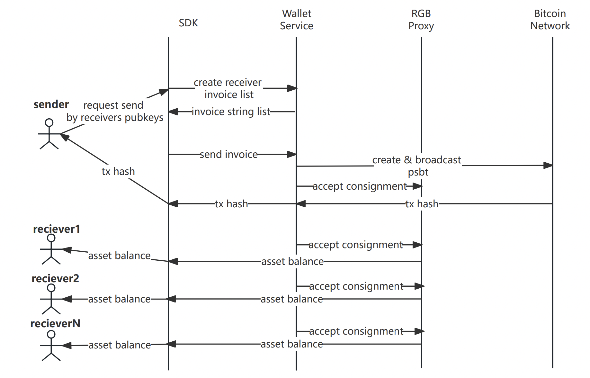

# BiHelix Wallet SDK

The BiHelix Wallet SDK is an innovative wallet solution tailored for Web3 users and developers, providing them with secure and reliable support for native Bitcoin transactions, ensuring seamless digital asset management. Additionally, the BiHelix Wallet SDK integrates RGB protocol and Lightning Network (LN) technology, enabling developers to effortlessly integrate RGB protocol and Bitcoin payments into their applications with a very shallow learning curve. As the premier choice based on the native Bitcoin blockchain, the BiHelix Wallet SDK offers powerful and flexible tools, empowering you to easily take control of your Web3 assets.

The BiHelix Wallet SDK offers the following services:

- RGB Asset Protocol (currently supporting RGB20, with upcoming support for RGB21, RGB22, and more)
- Client-side PSBT signer
- Multi-transfer supported
- Boost transfer supported with BiHelix BID technology
- PayJoin, CoinJoin procotol will be supported soon

## Contents

- [Installation](#Installation)
- [Usage](#Usage)
- [Diagram](#Diagram)
- [Methods](#Methods)
  - [assetBalance](#assetBalance)
  - [transactionList](#transactionList)
  - [receiveAsset](#receiveAsset)
  - [createAssetPsbt](#createAssetPsbt)
  - [signPSBT](#signPSBT)
  - [acceptAsset](#acceptAsset)

## Installation

```bash
npm install https://github.com/bihelix-io/bihelix-wallet-sdk
```

## Usage

Initialize wallet instance.

```javascript
// import sdk package
const SDK = require("bihelix-wallet-sdk");

// pubKey format provided as followed: include fingerprint, hardened derivation(must be m/86'/1'/0'/9)
// wpkh([27aadcbe/86h/1h/0h/9h]tpubDE6PJcj5LtD...aKTJTTs4zL1ygwYNe/0/*)#l4gyh4a3
const sdk = new SDK(provider, pubKey);
```

## Diagram

RGB20 token (multi) transfer process.


## Methods

### assetBalance

#### Description

Get asset balance for specific asset id.

#### Example

```javascript
const assetId = "rgb:TtFdiA7-obrjvvTbK-b8VrWD9ne-y9NyAPYha-qvSRrrh7s-aJ6Qs7";
const result = sdk.assetBalance(assetId);
```

#### Parameters

- assetId: string

#### Returns

```json
{
  "code": 0,
  "msg": null,
  "data": {
    "settled": 10000,
    "future": 10000,
    "spendable": 10000
  }
}
```

### transactionList

#### Description

Fetch all history transations for specific asset id.

#### Example

```javascript
const assetId = "rgb:TtFdiA7-obrjvvTbK-b8VrWD9ne-y9NyAPYha-qvSRrrh7s-aJ6Qs7";
const result = sdk.transactionList(assetId);
```

#### Parameters

- assetId: string

#### Returns

```json
{
  "code": 0,
  "msg": null,
  "data": [
    {
      "idx": 1,
      "created_at": 1711703957,
      "updated_at": 1711703957,
      "status": "Settled",
      "amount": 100000,
      "kind": "Issuance"
    }
  ]
}
```

### receiveAsset

#### Description

Create a transaction invoice form receiver.

#### Example

```javascript
const recPubKeys = "wpkh([a8b0c10f/86/1/0/9]tpubzcnE7e7...Sowq4Jwjg1EV4Qm61W/0/*),wpkh([27aadcbe/86h1/0/9]tpubDE6PsKkaL69G...NeTBH1wgwYNe/0/*)";
const assetId = "rgb:TtFdiA7-obrjvvTbK-b8VrWD9ne-y9NyAPYha-qvSRrrh7s-aJ6Qs7";
const amounts = "1000,2000";
const result = sdk.receiveAsset(recPubKeys, assetId, amounts);
```

#### Parameters

- recPubKeys: string Multiple receive pubKey separated by commas
- assetId: string
- amounts: string each amount to be send

#### Returns

```json
{
  "code": 0,
  "msg": null,
  "data": [
    {
      "invoice": "rgb:2uxU95k-eh4dzC1y3-tfM2Mka5T-aMfWoH8/RGB20/1000+utxob:JGV9FPn-8y2FjqwHv-BF6bmZ?expiry=1711940171&endpoints=rpc://10.0.0.162/json-rpc",
      "recipient_id": "utxob:JGV9FPn-rcRxeC1cd-uTHsTF7Mk-Mvj5PKuV8-8y2FjqwHv-BF6bmZ",
      "expiration_timestamp": 1711940171
    }
  ]
}
```

### createAssetPsbt

#### Description

create asset psbt.

#### Example

```javascript
const assetId = "rgb:TtFdiA7-obrjvvTbK-b8VrWD9ne-y9NyAPYha-qvSRrrh7s-aJ6Qs7";
const amounts = "1000,2000";
const invoices = "rgb:2uxU95k-eh4dzC1y3-...&endpoints=rpc://127.0.0.1/json-rpc,rgb:2uxU95...&endpoints=rpc://127.0.0.1/json-rpc";
const result = sdk.createAssetPsbt(assetId, amounts, invoices);
```

#### Parameters

- assetId: string
- amounts: string each amount to be send
- invoices: string each invoice to be send

#### Returns

```json
{
  "code": 0,
  "msg": "success",
  "data": {
    "psbtStr": "cHNidP8BAH0BAAAAA...VYAAAABAAAAAACQAAAAA=",
    "recipientIds": "utxob:JGV9FPn-rcRxeC1...v-BF6bmZ,utxob:DxvnPGz-NKfPf...iD-fgpej8nu7-ggheVt",
    "pathList": ["m/86/1/0/9/0/2"],
    "assetId": "rgb:2uxU95k-eh4dzC1y3-tfM2Mka5T-eakP4Rh66-MZiA2vUe1-aMfWoH8"
  }
}
```

### signPSBT

#### Description

psbt sign.

#### Example

```javascript
const psbtStr = "cHNidP8BAH0BAAAAATazRphM3Wknh...AAAAAAAACwAAAAA=";
const privKeys = "cS1xrY3NBeQKvzFqee3b9VeEhCHDmrfE66Y5wpPoRjXfj2iHA6iU,cS177Y3NBeQKvzFqee3b9VeEhggDmrfE5SY5wpP77jXfj2iHA6iU";
const result = sdk.signPSBT(psbtStr, privKeys);
```

#### Parameters

- psbtStr: string
- privKeys: string Multiple privateKey separated by commas

#### Returns

```json
{
  "code": 0,
  "msg": "success",
  "data": {
    "psbt": "cHNiuywRIV8EKkSjPxX2Ec6CXAc0mmhzkAw...ysUh4RiBrqXbVAAAAACQAABBB0AAAAA"
  }
}
```

### acceptAsset

#### Description

accecpt asset.

#### Example

```javascript
const psbt = "cHNid678AH0BAAAAATazRphM3Wknh...AAAAAAAACwAACCA=";
const assetId = "rgb:TtFdiA7-obrjvvTbK-b8VrWD9ne-y9NyAPYha-qvSRrrh7s-aJ6Qs7";
const recipientIds = "utxob:K91zpuP-ykQsfNC9x-xGtASYUuE-3Zxrzerps,utxob:9K12puP-ykSSfNC9x-xGtTTYUuE-3Zxrzerps";
const result = sdk.acceptAsset(psbt, assetId, recipientIds);
```

#### Parameters

- psbt: string
- assetId: string
- recipientIds: string Multiple recipientId separated by commas

#### Returns

```json
{
  "code": 0,
  "msg": "success",
  "data": {
    "txid": "2f66a276ce773d7ccf0ab4c86aaa645b56c2cc6998138b8895d558cb9fss320b"
  }
}
```
