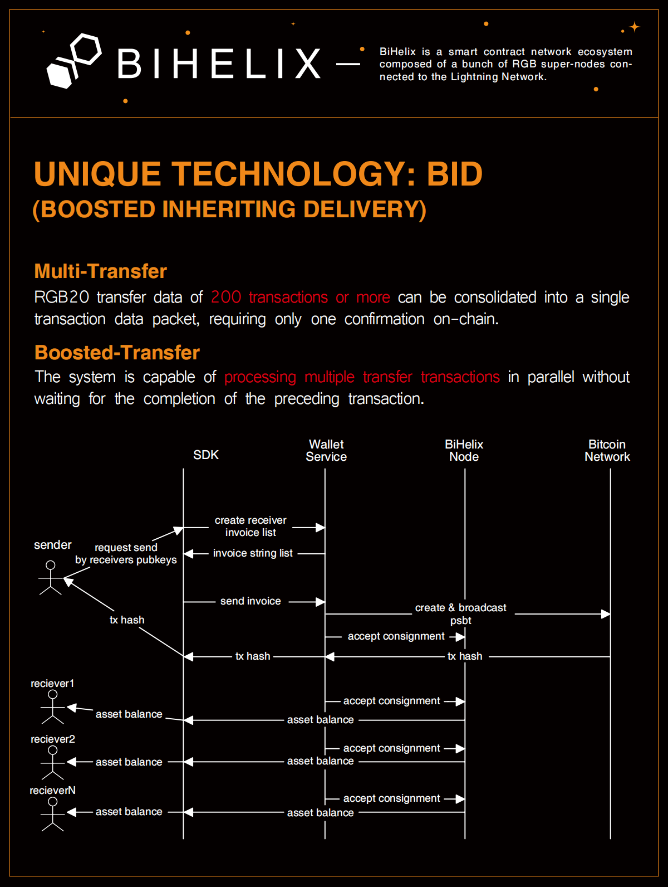

# BiHelix Wallet SDK

The BiHelix Wallet SDK is an innovative wallet solution tailored for Web3 users and developers, providing them with secure and reliable support for native Bitcoin transactions, ensuring seamless digital asset management.

Additionally, the BiHelix Wallet SDK integrates RGB protocol and Lightning Network (LN) technology, enabling developers to effortlessly integrate RGB protocol and Bitcoin payments into their applications with a very shallow learning curve. As the premier choice based on the native Bitcoin blockchain, the BiHelix Wallet SDK offers powerful and flexible tools, empowering you to easily take control of your Web3 assets.

The BiHelix Wallet SDK offers the following services:

- RGB Asset Protocol (currently supporting RGB20, with upcoming support for RGB21 and more)
- Client-side PSBT signer
- Multi-transfer supported
- Boost transfer supported with BiHelix BID technology
- PayJoin, CoinJoin procotol will be supported soon

## Contents

- [Installation](#Installation)
- [Usage](#Usage)
- [Diagram](#Diagram)
- [Methods](#Methods)
  - [unspentList](#unspentList)
  - [assetRegistry](#assetRegistry)
  - [assetList](#assetList)
  - [assetBalance](#assetBalance)
  - [transactionList](#transactionList)
  - [createAssetInvoice](#createAssetInvoice)
  - [createAssetPSBT](#createAssetPSBT)
  - [createCSVPSBT](#createCSVPSBT)
  - [signPSBT](#signPSBT)
  - [unsignedPSPB](#unsignedPSPB)
  - [createMultiAssetPSBT](#createMultiAssetPSBT)
  - [acceptMultiAsset](#acceptMultiAsset)
  - [exportDescriptor](#exportDescriptor)
  - [exportFullDescriptor](#exportFullDescriptor)
  - [convertExtendPubKey](#convertExtendPubKey)
  - [failTransfer](#failTransfer)
  - [delTransfer](#delTransfer)

## Installation

```bash
npm install https://github.com/bihelix-io/bihelix-wallet-sdk
```

## Usage

> When creating a new wallet, it is recommended to use the derivation `m/86/1/0/9` (**Non-hardened derivation**) as suggested by the RGB official. Theoretically, other derivations are also supported for now, currently there is no restriction.

Initialize wallet instance

```javascript
// import sdk package
const SDK = require("bihelix-wallet-sdk");

// address = "tb1qqek00zlz2eea4r9jkv2hzfss4l0uqayk485xr7"
const sdk = new SDK(provider, address);
```

## Diagram

RGB20 token (multi) transfer process



## Methods

### unspentList

#### Description

Get unspent utxo list

#### Example

```javascript
const address = "tb1qfe4n5w37s29h8z2xvkn49596g3wemznkc3cmmx";
const result = await sdk.unspentList(address);
```

#### Parameters

- address: string

#### Returns

```json
{
  "code": 0,
  "msg": "success",
  "data": {
    "unspents": [
      {
        "utxo": {
          "outpoint": {
            "txid": "186e0b6a19a593a0100adead6376a88dfca5e745c8c5a79d2b1239fa33d3815b",
            "vout": 0
          },
          "btc_amount": 6000,
          "colorable": true
        },
        "rgb_allocations": [
          {
            "asset_id": "rgb:28erwHp-KbsgGTLUk-9HVTBQ94W-9q5VFSB3s-44wFYLb98-kUPhLuF",
            "amount": 1500,
            "settled": true
          },
          {
            "asset_id": "rgb:28erwHp-KbsgGTLUk-9HVTBQ94W-9q5VFSB3s-44wFYLb98-kUPhLuF",
            "amount": 500,
            "settled": true
          }
        ]
      }
    ]
  }
}
```

### assetRegistry

#### Description

Get issued asset list

#### Example

```javascript
const result = await sdk.assetRegistry();
```

#### Parameters

#### Returns

```json
{
  "code": 0,
  "msg": "success",
  "data": [
    {
      "asset_owner": "tb1qrspdu96a9s2qx39a4mqpzf4guxz7l3w7t8h6dv",
      "asset_id": "rgb:2DFQNGC-f29tozN8w-oj222Sapy-M985R8dYA-cQD4VjLYB-zWfvp54",
      "asset_schema": "RGB20",
      "issued_supply": "1000000",
      "asset_ticker": "RGBTEST4",
      "asset_name": "RGBTest4",
      "asset_precision": 0
    }
  ]
}
```

### assetList

#### Description

Get asset list

#### Example

```javascript
const assetTypes = "rgb20";
const result = await sdk.assetList(assetTypes);
```

#### Parameters

- assetTypes: string

#### Returns

- settled: confirmed amount
- future: pending amount
- spendable: available and spendable amount

```json
{
  "code": 0,
  "msg": "success",
  "data": {
    "assets": [
      {
        "asset": {
          "asset_id": "rgb:28erwHp-KbsgGTLUk-9HVTBQ94W-9q5VFSB3s-44wFYLb98-kUPhLuF",
          "asset_iface": "RGB20",
          "ticker": "RGBTEST4",
          "name": "RGBTest4",
          "precision": 0,
          "issued_supply": 1000000,
          "timestamp": 1713322847,
          "added_at": 1713322847,
          "balance": {
            "settled": 994000,
            "future": 993500,
            "spendable": 994000
          }
        },
        "utxos": [
          {
            "outpoint": {
              "txid": "0e881b54ff1c82070844655e24174d5f91132ecc9c446cd282b9bec206233527",
              "vout": 1
            },
            "btc_amount": 15221,
            "colorable": true
          }
        ]
      }
    ]
  }
}
```

### assetBalance

#### Description

Get asset balance by specific asset id

#### Example

```javascript
const assetId = "rgb:TtFdiA7-obrjvvTbK-b8VrWD9ne-y9NyAPYha-qvSRrrh7s-aJ6Qs7";
const result = await sdk.assetBalance(assetId);
```

#### Parameters

- assetId: string

#### Returns

- settled: confirmed amount
- future: pending amount
- spendable: available and spendable amount

```json
{
  "code": 0,
  "msg": "success",
  "data": {
    "settled": 10000,
    "future": 10000,
    "spendable": 10000
  }
}
```

### transactionList

#### Description

Fetch all history transations by specific asset id

#### Example

```javascript
const assetId = "rgb:TtFdiA7-obrjvvTbK-b8VrWD9ne-y9NyAPYha-qvSRrrh7s-aJ6Qs7";
const pageSize = 10;
const pageNo = 1;
const result = await sdk.transactionList(assetId, pageSize, pageNo);
```

#### Parameters

- assetId: string
- pageSize: int
- pageNo: int

#### Returns

```json
{
  "code": 0,
  "msg": "success",
  "data": [
    {
      "idx": 1,
      "batch_transfer_idx": 1,
      "created_at": 1714371014,
      "updated_at": 1714374494,
      "status": "Settled",
      "amount": 100,
      "kind": "ReceiveBlind",
      "sender": "tb1q86kuzty6rqez8v6mkzwqsmwfgem8jvz8te8zps",
      "receiver": "tb1qs6vjt8c3lj6rtp2wpq5y55mxmu256837nh6cts",
      "txid": "72a80132c1a69357f86f94c74fa4d81d3611b3a6e292afaf8e3e831b8124a2a8",
      "recipient_id": "tb:utxob:w74XPb8-gijKLk327-bKtvB38rF-Dr7vVNGo8-bgp16k4Dq-aWPaVf",
      "receive_utxo": {
        "txid": "a76c3ea1e86c514dbfc7249bf905bd6ff6deedbb958eb636534ca29af547d63b",
        "vout": 3
      },
      "change_utxo": null,
      "expiration": 1714374614,
      "transport_endpoints": [
        {
          "endpoint": "http://127.0.0.0:8080/json-rpc",
          "transport_type": "JsonRpc",
          "used": true
        }
      ]
    }
  ]
}
```

### createAssetInvoice

#### Description

Create a transaction invoice form receiver

#### Example

```javascript
const address = "tb1qqek00zlz2eea4r9jkv2hzfss4l0uqayk485xr7,tb1qskr93hdje2pcnp6w558zxxp6wenvc7emvdm567";
const assetId = "rgb:TtFdiA7-obrjvvTbK-b8VrWD9ne-y9NyAPYha-qvSRrrh7s-aJ6Qs7";
const amounts = "1000,2000";
const result = await sdk.createAssetInvoice(address, assetId, amounts);
```

#### Parameters

- address: string Multiple receive address separated by commas
- assetId: string
- amounts: string each amount to be send

#### Returns

```json
{
  "code": 0,
  "msg": "success",
  "data": [
    {
      "invoice": "rgb:2uxU95k-eh4dzC1y3-tfM2Mka5T-aMfWoH8/RGB20/1000+utxob:JGV9FPn-8y2FjqwHv-BF6bmZ?expiry=1711940171&endpoints=rpc://10.0.0.162/json-rpc",
      "recipient_id": "utxob:JGV9FPn-rcRxeC1cd-uTHsTF7Mk-Mvj5PKuV8-8y2FjqwHv-BF6bmZ",
      "expiration_timestamp": 1711940171
    }
  ]
}
```

### createAssetPSBT

#### Description

Create asset psbt

#### Example

```javascript
const pubKey = "wpkh([a8b0c10f/86/1/0/9]tpubDE89YTZ8zcnE7e74aY5ai4uHvqc5...ZUVAMJ7wekwVumWn6Sowq4JwjCzCVKQz2qSgzD1EV4Qm61W/0/*)";
const assetId = "rgb:TtFdiA7-obrjvvTbK-b8VrWD9ne-y9NyAPYha-qvSRrrh7s-aJ6Qs7";
const amounts = "1000,2000";
const invoices = "rgb:2uxU95k-eh4dzC1y3-...&endpoints=rpc://127.0.0.1/json-rpc,rgb:2uxU95...&endpoints=rpc://127.0.0.1/json-rpc";
const feeRate = 30;
const result = await sdk.createAssetPSBT(pubKey, assetId, amounts, invoices, feeRate);
```

#### Parameters

- pubKey: string
- assetId: string
- amounts: string each amount to be send
- invoices: string each invoice to be send
- feeRate: float

#### Returns

```json
{
  "code": 0,
  "msg": "success",
  "data": {
    "psbtStr": "cHNidP8BAH0BAAAAA...VYAAAABAAAAAACQAAAAA=",
    "recipientIds": "utxob:JGV9FPn-rcRxeC1...v-BF6bmZ,utxob:DxvnPGz-NKfPf...iD-fgpej8nu7-ggheVt",
    "pathList": ["m/86/1/0/9/0/2", "m/86/1/0/9/0/6"],
    "assetId": "rgb:2uxU95k-eh4dzC1y3-tfM2Mka5T-eakP4Rh66-MZiA2vUe1-aMfWoH8"
  }
}
```

### createCSVPSBT

#### Description

Create customize csv data

#### Example

```javascript
const pk = "wpkh(03d044eefd0699c307a5f2aaf30d7a5434e9ca22173b42497888fc43e439d17cfc)";
const commitment = "abdetg3stssselisgitabegihpimklos";
const feeRate = 60.0;
const result = await sdk.createCSVPSBT(pk, commitment, feeRate);
```

#### Parameters

- pk: string
- commitment: string
- feeRate: float

#### Returns

```json
{
  "code": 0,
  "msg": "success",
  "data": {
    "psbt": "cHNidP8BAH0BAAAAARK2XXQGzxi8RNXyjcRsewWB......sAs4yJssEHALeFwAI/AVPUFJFVAEgYWJkZXRnM3N0c3NzZWxpc2dpdGFiZWdpaHBpbWtsb3MA"
  }
}
```

### signPSBT

#### Description

Sign psbt by sender

#### Example

```javascript
const psbtStr = "cHNidP8BAH0BAAAAATazRphM3Wknh...AAAAAAAACwAAAAA=";
const privKeys = "cS1xrY3NBeQKvzFqee3b9VeEhCHDmrfE66Y5wpPoRjXfj2iHA6iU,cS177Y3NBeQKvzFqee3b9VeEhggDmrfE5SY5wpP77jXfj2iHA6iU";
const result = sdk.signPSBT(psbtStr, privKeys);
```

#### Parameters

- psbtStr: string
- privKeys: string Multiple privateKey separated by commas

#### Returns

```json
{
  "code": 0,
  "msg": "success",
  "data": {
    "psbt": "cHNiuywRIV8EKkSjPxX2Ec6CXAc0mmhzkAw...ysUh4RiBrqXbVAAAAACQAABBB0AAAAA"
  }
}
```

### unsignedPSPB

#### Description

Get unsigned psbt data

#### Example

```javascript
const utxoArray = [utxo, utxo, utxo];
const address = "tb1qfe4n5w37s29h8z2xvkn49596g3wemznkc3cmmx";
const amount = 1000;
const result = sdk.unsignedPSPB(utxoArray, address, amount);
```

#### Parameters

- utxoArray: array
- address: string
- amount: int

#### Returns

```json
{
  "code": 0,
  "msg": "success",
  "data": {
    "psbt": "cHNiuywRIV8EKkSjPxX2Ec6CXAc0mmh...sUh4RiBrqXbVAAAAACQAABBB0AAAAA"
  }
}
```

### createMultiAssetPSBT

#### Description

Create multiple assets PSBT

#### Example

```javascript
const pubKey = "wpkh(02c1d6ed8034acd0b8b69d3ss49b0602d90250673e998e54b0a8b89581764d7aa5)";
const invoices = [
  {
    asset_id: "rgb:2ZyMWs7-3pbiFDwFu-b6ir4LNDT-wamPbBT5B-jXyeRkDnV-BrjP3fr",
    invoice: "rgb:2ZyMWs7-3pbiFDwFu-b6ir4LNDT-wamPbBT5B-jXyeRkDnV-...points=rpc://127.0.0.1:8080/json-rpc",
    recipient_id: "tb:utxob:2bVJDP7-MTAZsTEX6-ksAn2udWY-us1yHuxtG-JJRoCB9rF-Bobnqp",
    amount: 5000,
  },
];
const feeRate = 120;
const donation = true;
const result = sdk.createMultiAssetPSBT(pubKey, invoices, feeRate, donation);
```

#### Parameters

- pubKey: string
- invoices: array
- feeRate: float
- donation: boolean

#### Returns

```json
{
  "code": 0,
  "msg": "success",
  "data": {
    "psbt": "03af972eea......8c7766399e59d0",
    "txid": "a03af972eea88ee0a8aef0a0bad8c7766399e59d029d443f2ee1c8e189d6e1ab"
  }
}
```

### acceptMultiAsset

#### Description

Accept multiple assets

#### Example

```javascript
const pubKey = "wpkh(02c1d6ed8034acd0b8b69d34c49ss602d90250673e998e54b0a8b89581764d7aa5)";
const psbt = "9+u5IdAZLZ2iSMMSr//8AA......AABAKUMIbtyg ";
const recipientIds = "tb:utxob:2XjRbuR-tZ...rZfG5-JaAPnsxHc-eBss1yG,tb:utxob:2XjRbuR-tZn...3CsE-JaAPnsxHc-eBss1yG";
const assetIds = "rgb:2ZyMWs...b6ir4LNDT-wamPbBDnV-BrjP3fr,rgb:2ZyMWs7-3p...NDT-wamPbBT5B-jXyeRkDnV-BrjP3fr";
const result = sdk.acceptMultiAsset(pubKey, psbt, recipientIds, assetIds);
```

#### Parameters

- pubKey: string
- psbt: string
- recipientIds: string
- assetIds: string

#### Returns

```json
{
  "code": 0,
  "msg": "success",
  "data": {
    "txid": "a03af972eea88ee0a8aef0a0bad8c7766399e59d029d443f2ee1c8e189d6e1ab"
  }
}
```

### exportDescriptor

#### Description

Export descriptor public key

#### Example

```javascript
const privateKey = "cRcKBdLUhJqvCR1E8sgKVc46Pygjtm6XXouCXo1ziokXjN1914DT";
const result = sdk.exportDescriptor(privateKey);
```

#### Parameters

- privateKey: string

#### Returns

```json
{
  "code": 0,
  "msg": "success",
  "data": {
    "pubKey": "wpkh(038f740d3b28bef5d7e6135ef9bac56cefb2998cc0dafe289843f21faf16d04d0e)"
  }
}
```

### exportFullDescriptor

#### Description

Export full descriptor public key

#### Example

```javascript
const mnemonic = "patient photo smoke cream sketch mandate lunch loyal tornado genre mouse diamond";
const path = "m/86/1/0/9";
const password = "";
const result = sdk.exportFullDescriptor(mnemonic, path, password);
```

#### Parameters

- privateKey: string
- path: string
- password: string default=""

#### Returns

```json
{
  "code": 0,
  "msg": "success",
  "data": {
    "pubKey": "wpkh([ce7e53f5/86/1/0/9]tpubDFgEZRxAk7bi2xohFuZ9uSCnC4d...GtTzULg7vyUZkH3ve4218yj73xocR9zjxY1sRZNyHU4aQaKK4jywe/0/*)"
  }
}
```

### convertExtendPubKey

#### Description

Convert extended publickey

#### Example

```javascript
const vpub = "vpub5a5zQtPcyyjp9FXyTdXF5yNvFnDXM1tkgkmZJAnrWbmKaDhbBHsuUfJLNFBL3AE5k7MRYEEWTLyddh6CzodgFJAhh3GqBV9UroHXwtNVW8g";
const result = sdk.convertExtendPubKey(vpub);
```

#### Parameters

- vpub: string

#### Returns

```json
{
  "code": 0,
  "msg": "success",
  "data": {
    "pubKey": "tpubDE89YTZ8zcnE7e74aY5ai4uHvqc5DeNp4cQJDWdmcXGyRhzkkq47sEHSehBHZUVAMJ7wekwVumWn6Sowq4JwjCzCVKQz2qSgzD1EV4Qm61W"
  }
}
```

### failTransfer

#### Description

Check for expired transactions and set status to 'failed'

#### Example

```javascript
const idx = 0;
const assetOnly = false;
const result = sdk.failTransfer(idx, assetOnly);
```

#### Parameters

- idx: int
- assetOnly: boolean

#### Returns

```json
{
  "code": 0,
  "msg": "success",
  "data": false
}
```
