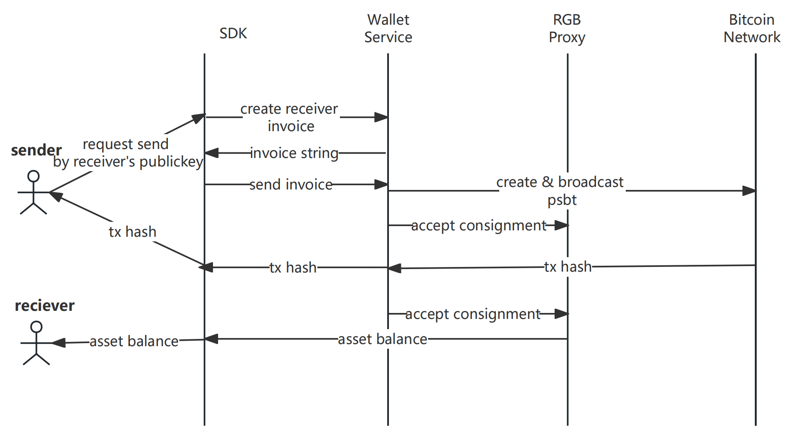

# BiHelix Wallet SDK
The BiHelix Wallet SDK is an innovative wallet solution tailored for Web3 users and developers, providing them with secure and reliable support for native Bitcoin transactions, ensuring seamless digital asset management. Additionally, the BiHelix Wallet SDK integrates RGB protocol and Lightning Network (LN) technology, enabling developers to effortlessly integrate RGB protocol and Bitcoin payments into their applications with a very shallow learning curve. As the premier choice based on the native Bitcoin blockchain, the BiHelix Wallet SDK offers powerful and flexible tools, empowering you to easily take control of your Web3 assets.

The BiHelix Wallet SDK offers the following services:
- RGB Asset Protocol (currently supporting RGB20, with upcoming support for RGB21, RGB22, and more)
- Client-side PSBT signer
- Boost transfer supported with BiHelix BIE technology
- PayJoin, CoinJoin procotol will be supported soon

## Contents
- [Installation](#Installation)
- [Usage](#Usage)
- [Diagram](#Diagram)
- [Methods](#Methods)
  - [getMnemonic](#getMnemonic)
  - [getPubPrivKey](#getPubPrivKey)
  - [createRGBWallet](#createRGBWallet)
  - [getAssetBalance](#getAssetBalance)
  - [transfer](#transfer)
  - [recieve](#recieve)
  - [send](#send)
  - [getHistoryTransaction](#getHistoryTransaction)

## Installation
```bash
npm install https://github.com/bihelix-io/bihelix-wallet-sdk
```

## Usage
Two ways wallet instance can be initialized.
```javascript
const SDK = require("bihelix-wallet-sdk")

// provider required and cannot be empty, default bitcoin mainnet, mnemonic generated automatically
const sdk = new SDK(provider);

// provider required and cannot be empty, specific parameters given, network = bitcoin|testnet|regtest (default bitcoin)
const sdk = new SDK(provider, {
    network: "bitcoin",
    mnemonic: "bullet,couple,ostrich,thumb,category,estate,machine,logic,depart,satisfy,ball,rural",
    password: "123456"
});
```

Create Account
```javascript
const account = sdk.createRGBWallet()
```

## Diagram
RGB20 token transfer process.


## Methods
### getMnemonic
#### Description
Generate a random mnemonic.

#### Example
```javascript
const mnemonic = sdk.getMnemonic();
```

#### Parameters
None

#### Returns
```json
{
    "code":0,
    "msg":"success",
    "data":{
        "mnemonic":"bullet,couple,ostrich,thumb,category,estate,machine,logic,depart,satisfy,ball,rural"
    }
}
```

### getPubPrivKey
#### Description
Generate public, private key pair by mnemonic.

#### Example
```javascript
const result = sdk.getPubPrivKey(mnemonic);
```

#### Parameters
- mnemonic: string
- password: string, default=""
- derivationPath: string, default="m/86'/1'/0'/9"
- type: string, default="rgb"

#### Returns
```json
{
    "code":0,
    "msg":"success",
    "data":{
        "pubKey":"tpubD6NzVbkrYhZ4Xsc9GzcTcUFfb5aqUf956MyeUTfenWUUUpdDwYKLneHN9g3tcCHeNDLVDftgx7RCxKuf8SRTGP3Qix9LEc679uMdz9n8jkf",
        "address":"tb1qkyes053gsvf4phf5nl2rcaa0pnzmpcnmq8geej",
        "privateKey":"cUtocvDv77JBKLHo3QPQADTWsnWfm6XZt6igguCb3nRfUWjzNH1e"
    }
}
```

### createRGBWallet
#### Description
Create a rgb wallet instance.

#### Example
```javascript
const result = sdk.createRGBWallet(mnemonic, password, derivationPath, feeRate, upTo);
```

#### Parameters
- mnemonic: string default=""
- password: string default=""
- derivationPath: string, default="m/86'/1'/0'/9"
- feeRate: string, default=1.5
- upTo: boolean, default=true

#### Returns
```json
{
   "code":0,
   "msg":"success",
   "data":{
      "pubKey":"tpubD6NzVbkrYhZ4Xsc9GzcTcUFfb5aqUf956MyeUTfenWUUUpdDwYKLneHN9g3tcCHeNDLVDftgx7RCxKuf8SRTGP3Qix9LEc679uMdz9n8jkf",
      "address":"tb1qkyes053gsvf4phf5nl2rcaa0pnzmpcnmq8geej",
      "privateKey":"cUtocvDv77JBKLHo3QPQADTWsnWfm6XZt6igguCb3nRfUWjzNH1e",
      "mnemonic":"bullet,couple,ostrich,thumb,category,estate,machine,logic,depart,satisfy,ball,rural"
   }
}
```

### getAssetBalance
#### Description
Get asset balance.
#### Example

```javascript
const result = sdk.getAssetBalance(pubKey, assetId);
```

#### Parameters
- pubKey: string
- assetId: string

#### Returns
```json
{
   "code":0,
   "msg":"success",
   "data":{
      "settled":10000,
      "future":10000,
      "spendable":10000
   }
}
```

### transfer
#### Description
Creating a transaction form sender to receiver.

#### Example
```javascript
const result = sdk.transfer(reciPubKeys, sendPk, assetId, amounts, donation, assetTypes)
```

#### Parameters
- reciPubKeys: string   Multiple reciPubKeys separated by commas
- sendPk: string
- assetId: string
- amounts: string   Multiple amounts separated by commas
- donation: boolean default=false
- assetTypes: string default="rgb20,rgb21,rgb25"

#### Returns
```json
{
   "code":0,
   "msg":"success",
   "data":{
      "txid":"de2de8c516115531cafb4a8d16a81074aa30e60aa54bdae798de29d8ab85d1cc"
   }
}
```

### recieve
#### Description
Creating a transaction invoice form receiver.

#### Example
```javascript
const result = sdk.recieve(recPubKey, sendPubKey, assetId, amount, assetTypes)
```

#### Parameters
- recPubKey: string
- sendPubKey: string
- assetId: string
- amount: float
- assetTypes: string, default="rgb20,rgb21,rgb25"

#### Returns
```json
{
   "code":0,
   "msg":"success",
   "data":{
      "invoice":"rgb:2JcBsah-PHvhjrGp8-ZcbqkNEvF-QezXSoSAA-voyB3tvmQ-widUsE8/RGB20/2+utxob:qV7JwRs-KjvXpuVfA-LJR6hWfK7-avZ6iZQeV-ntaKD3mBT-ehGsGJ?expiry=1709199079&endpoints=rpc://127.0.0.1:4001/json-rpc",
      "recipient_id":"utxob:qV7JwRs-KjvXpuVfA-LJR6hWfK7-avZ6iZQeV-ntaKD3mBT-ehGsGJ",
      "expiration_timestamp":1709199079
   }
}
```

### send
#### Description
Creating a transaction form sender.

#### Example
```javascript
const result = sdk.send(pubKey, assetId, amounts, invoices, donation)
```

#### Parameters
- pubKey: string
- assetId: string
- amounts: array
- invoices: array
- donation: boolean default=false

#### Returns
```json
{
   "code":0,
   "msg":"success",
   "data":{
      "txid":"2f56a276ce4f3d7ccf0ab4c86aed645b56c2cc6998138b8895d558cb9fc3320b"
   }
}
```

### getHistoryTransaction
#### Description
Fetch all history transations.

#### Example
```javascript
const result = sdk.getHistoryTransaction(pubKey, assetId)
```

#### Parameters
- pubKey: string
- assetId: string

#### Returns
```json
[
   {
      "idx":1,
      "created_at":1710815086,
      "updated_at":1710815186,
      "status":"Settled",
      "amount":5000,
      "kind":"ReceiveBlind",
      "txid":"0921629f6edde00f05bf67c82daf8927ef31fccb875ceb2cc4167950ae7b6f72",
      "recipient_id":"utxob:ALWUgEa-pU82WNuYE-r4XvfYUrU-Z5ZZgn5Dr-GpFExCGPP-r82izT",
      "receive_utxo":{
         "txid":"1e2d362915354bec0c84ebf5eef948d414734f602002bb4f30692ca1615e4948",
         "vout":0
      },
      "expiration":1710818686,
      "transport_endpoints":[
         {
            "endpoint":"http://127.0.0.1:4001/json-rpc",
            "transport_type":"JsonRpc",
            "used":true
         }
      ]
   }
]
```
